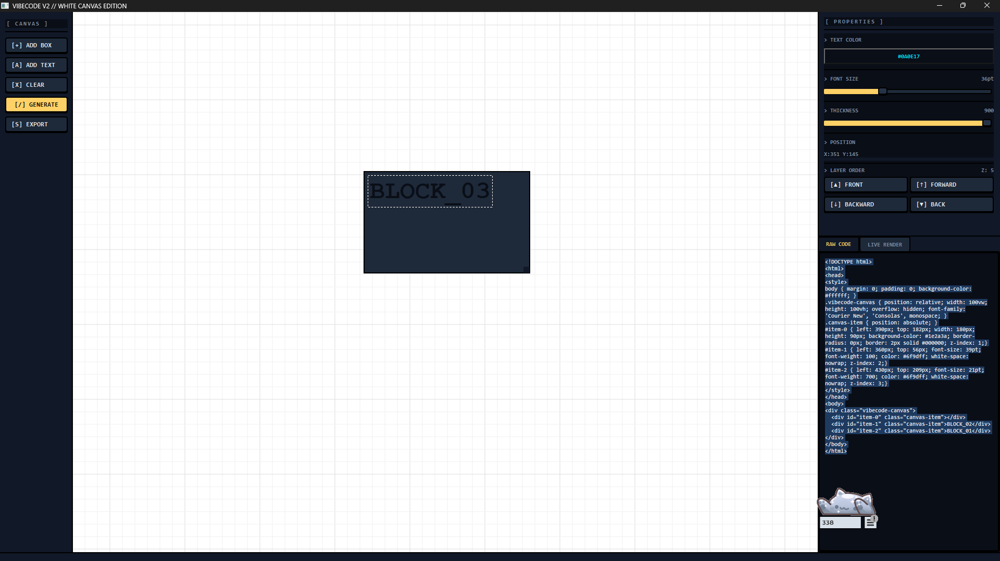

# DrawScript — White Canvas Edition


> **Stop sketching wireframes in one tool, styling them in another, and then hand-writing the HTML from scratch. DrawScript does all three — simultaneously.**

DrawScript is a desktop design-to-code tool built with Python and PyQt6. You drag, drop, style, and stack elements on a live canvas — then hit one button to compile everything into clean, absolute-positioned HTML and CSS, ready to drop into any project.

The UI is deliberately retro. Chunky pixel borders. Neon cyan accents. A midnight navy panel against a crisp white canvas. It looks like a game dev tool from 2003 and it's faster to use than anything that came after it.

---



---

## What it actually does

Most wireframing tools stop at the picture. DrawScript treats the canvas as a **compiler input**. Every element you place — its position, color, size, stacking order — is real data. When you generate, that data becomes real CSS.

There's no intermediate format. No layers panel that doesn't match the output. No copy-pasting hex codes between windows. What you build on the canvas is exactly what the exporter writes.

---

## Features

### Canvas
- **24px snap grid** with subtle major/minor gridlines — precise layout without rulers
- **Drag-to-move** on any element; rubber-band selection for multi-select
- **Resizable boxes** with a dedicated drag handle at the bottom-right corner
- **Double-click to edit** text inline, directly on the canvas

### Boxes
- Custom **fill color** via a full color picker (alpha supported)
- **Corner radius** slider from sharp to fully rounded (0–60px)
- Live geometry readout: position and dimensions update as you drag

### Text
- **Font size** slider: 6pt to 96pt, continuous range
- **Font weight** slider: nine CSS-mapped levels from Thin (100) to Black (900)
- **Text color** via full color picker (alpha supported)
- Styling survives inline edits — color and weight re-apply automatically on focus-out

### Layer management
- **Bring to Front** / **Send to Back** — jump to the top or bottom of the stack in one click
- **Forward** / **Backward** — step one layer at a time for precise ordering
- Live **Z-index readout** in the inspector so you always know where an element sits

### Code output
- Instant **HTML + CSS generation** from the canvas state
- Side-by-side **RAW CODE** and **LIVE RENDER** tabs — see the output render in real time
- One-click **export to `.html`** file
- All z-index values, colors, sizes, and positions map 1:1 from canvas to code
- Text content is HTML-escaped — special characters never corrupt the output

### Clipboard & history
- **Copy / Paste** preserves all properties: color, size, weight, radius
- Each paste cascades 24px — repeated pastes never pile up on the same spot
- **Undo delete** — restore the last deleted item or group with a single shortcut

---

## Quick Start

### Prerequisites
- Python 3.8 or higher
- pip

### Install & run

```bash
git clone https://github.com/Stampy705/DrawScript.git
cd DrawScript
pip install -r requirements.txt
python main.py
```

That's it. No build step. No config file. One command.

---

## Keyboard Shortcuts

| Action | Shortcut |
|---|---|
| Copy selected | `Ctrl + C` |
| Paste | `Ctrl + V` |
| Delete selected | `Delete` or `Backspace` |
| Undo delete | `Ctrl + Z` |
| Generate code | `Ctrl + E` |

---

## How the export works

When you hit **[/] GENERATE**, DrawScript walks every item on the canvas, reads its live state, and emits a self-contained HTML file:

```html
<!DOCTYPE html>
<html>
<head>
<style>
  body { margin: 0; padding: 0; background-color: #ffffff; }
  .drawscript-canvas { position: relative; width: 100vw; height: 100vh; overflow: hidden; }
  .canvas-item { position: absolute; }

  #item-0 { left: 60px; top: 60px; width: 180px; height: 90px;
             background-color: #1e2a3a; border-radius: 0px;
             border: 2px solid #000000; z-index: 0; }

  #item-1 { left: 80px; top: 80px; font-size: 14pt; font-weight: 700;
             color: #0a0e17; white-space: nowrap; z-index: 1; }
</style>
</head>
<body>
  <div class="drawscript-canvas">
    <div id="item-0" class="canvas-item"></div>
    <div id="item-1" class="canvas-item">BLOCK_01</div>
  </div>
</body>
</html>
```

Items are sorted by z-index before output, so the stacking order you set in the inspector is exactly the stacking order in the browser.

---

## Project structure

```
DrawScript/
├── main.py            # Entire application — single file, zero dependencies beyond PyQt6
├── requirements.txt   # PyQt6>=6.5.0
├── .gitignore
└── README.md
```

The whole application lives in `main.py`. The architecture is intentionally flat:

| Class | Role |
|---|---|
| `DarkMainWindow` | Top-level window, toolbar, right panel, signal wiring |
| `KeyboardShortcutsMixin` | All keyboard shortcuts and clipboard logic |
| `DarkCanvasView` | QGraphicsView wrapper, grid drawing, item factory |
| `StyledRectItem` | Resizable box with custom paint, fill color, corner radius |
| `DraggableTextItem` | Editable text with bulletproof color/size/weight formatting |
| `PropertyInspector` | Context-sensitive panel — shows rect or text controls |

---

## Built with

- **Python 3** — language
- **PyQt6** — GUI framework (Graphics View for the canvas, QSS for styling)

---

## License

MIT — do whatever you want with it.
